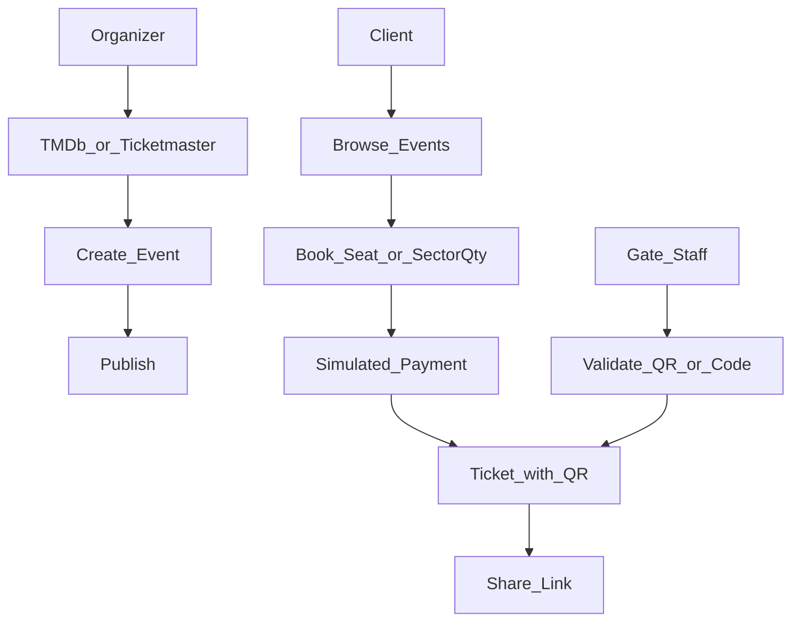

# PRD — Plataforma de Eventos e Ingressos

**Desafio:** Verzel Elite Dev  
**Produto:** plataforma para organizadores publicarem eventos e clientes comprarem ingressos  
**Status do doc:** guia de desenvolvimento
**Stack base:** monorepo pnpm + Turborepo — NestJS (`apps/api`), Next.js (`apps/web`), Prisma 7 (SQLite local / Turso em produção), JWT

---

## 1. Contexto e meta

Construir uma plataforma enxuta de descoberta, reserva e validação de ingressos.

Referências de fluxo (não copiar UI):

- [Ingresso.com](https://www.ingresso.com) — mapa de assentos
- [Eventim](https://www.eventim.com.br) — setores por quantidade
- [Sympla](https://www.sympla.com.br) — criação de evento e checkout

Catálogos externos sugeridos pelo enunciado:

- [Ticketmaster Discovery API](https://developer.ticketmaster.com/products-and-docs/apis/discovery-api/v2/)
- [TMDb](https://developer.themoviedb.org/docs)

---

## 2. Personas e roles

| Role        | Quem        | Pode                                                                                                   |
| ----------- | ----------- | ------------------------------------------------------------------------------------------------------ |
| `ORGANIZER` | Organizador | Buscar catálogo externo, criar/publicar eventos, definir data/local/preço/capacidade (mapa ou setores) |
| `CLIENT`    | Cliente     | Listar/buscar eventos, reservar, pagar (simulado), ver ingressos com QR, compartilhar link             |
| `GATE`      | Portaria    | Validar ingresso (câmera ou código manual): válido, inválido, já usado, evento errado                  |

Mapeamento técnico: estender `User.role` (hoje string default `USER`) para esses valores. Rotas protegidas por JWT + guard de role.

Seed obrigatório para avaliação:

- 1 organizador
- 2 clientes
- 1 usuário de portaria
- pelo menos 1 evento publicado com ingressos disponíveis

---

## 3. Escopo MVP

### Inclui

- Auth (já base: register/login/refresh) com roles
- Integração **TMDb e Ticketmaster** na criação de evento (organizador escolhe a fonte)
- Evento com data, local, preço e um modo de inventário:
  - `SEAT_MAP` — mapa de assentos
  - `GA_SECTOR` — quantidade por setor (pista/camarote/etc.)
- Listagem/busca de eventos publicados
- Reserva + pagamento simulado (aceitar e rejeitar)
- Ingresso com QR code + área “Meus ingressos”
- Link público de compartilhamento do ingresso
- Portaria: validação por QR (câmera) e entrada manual
- Persistência (Prisma) + README com setup + seed

### Não inclui

- Nota fiscal
- Revenda entre usuários
- App nativo
- Recuperação de senha
- Envio de ingresso por e-mail

---

## 4. Fluxos principais

### 4.1 Organizador

1. Autentica com role `ORGANIZER`
2. Busca título/show no catálogo (**TMDb** ou **Ticketmaster**)
3. Seleciona item externo e define: data/hora, local, preço, modo (`SEAT_MAP` | `GA_SECTOR`)
4. Configura inventário:
   - `SEAT_MAP`: gera grade (ex.: fileiras A–J × lugares 1–12) ou template fixo no MVP
   - `GA_SECTOR`: define setores com capacidade e preço (preço pode ser por setor ou herdado do evento)
5. Publica o evento (`DRAFT` → `PUBLISHED`)

### 4.2 Cliente

1. Navega eventos publicados (busca por nome; filtros extras são opcionais)
2. Abre detalhe (data, local, preço, poster/imagem quando a API externa fornecer)
3. Reserva:
   - `SEAT_MAP`: escolhe assento(s) disponíveis no mapa
   - `GA_SECTOR`: escolhe setor + quantidade
4. Inicia pagamento simulado → UI permite **confirmar** ou **rejeitar**
5. Se confirmado: gera `Ticket`(s) com código QR; aparece em “Meus ingressos”
6. Pode abrir link de compartilhamento (leitura pública do ingresso)

### 4.3 Portaria

1. Autentica com role `GATE`
2. Seleciona o evento em que está trabalhando (contexto obrigatório)
3. Escaneia QR pela câmera **ou** digita o código
4. Sistema responde claramente:
   - válido → marca como usado
   - inválido / assinatura quebrada
   - já utilizado
   - evento errado (ticket de outro evento)

---

## 5. Modelo de dados (conceitual)

Entidades (Prisma — a implementar depois):

| Entidade          | Campos-chave                                                                                                                                                                                       | Notas                                        |
| ----------------- | -------------------------------------------------------------------------------------------------------------------------------------------------------------------------------------------------- | -------------------------------------------- |
| `User`            | `email`, `password`, `name`, `role` (`ORGANIZER` \| `CLIENT` \| `GATE`)                                                                                                                            | Base já existe                               |
| `Event`           | `organizerId`, `title`, `description?`, `venue`, `startsAt`, `price`, `status`, `inventoryMode`, `externalSource` (`TMDB` \| `TICKETMASTER`), `externalId`, `externalPayload?` (JSON), `imageUrl?` | Um evento = uma fonte externa + um modo      |
| `Sector`          | `eventId`, `name`, `capacity`, `price?`                                                                                                                                                            | Só `GA_SECTOR`                               |
| `Seat`            | `eventId`, `label` (ex. `A12`), `row`, `number`, `status` (`AVAILABLE` \| `HELD` \| `SOLD`)                                                                                                        | Só `SEAT_MAP`                                |
| `Reservation`     | `eventId`, `userId`, `status` (`PENDING` \| `PAID` \| `FAILED` \| `EXPIRED` \| `CANCELLED`), `expiresAt?`                                                                                          | Agrupa itens antes/depois do pagamento       |
| `ReservationItem` | `reservationId`, `seatId?`, `sectorId?`, `quantity?`                                                                                                                                               | Assento único **ou** qtd no setor            |
| `Payment`         | `reservationId`, `status` (`APPROVED` \| `REJECTED`), `provider` (`SIMULATED`), `raw?`                                                                                                             | Sem cobrança real                            |
| `Ticket`          | `reservationId`, `userId`, `eventId`, `code` (opaco), `qrPayload`, `status` (`VALID` \| `USED` \| `VOID`), `validatedAt?`, `validatedById?`, `seatId?`, `sectorId?`                                | Um ticket por assento; em GA, um por unidade |
| `TicketShare`     | `ticketId`, `publicToken`, `createdAt`                                                                                                                                                             | Link público `/t/:token`                     |

Índices importantes: unicidade de `Seat` por evento+label; unicidade de `Ticket.code`; lookup rápido de share token.

---

## 6. API surface (rascunho)

Agrupado por módulo. Detalhes de DTO na implementação.

### Auth / users (base parcial já existe)

- `POST /auth/register` | `login` | `refresh` | `logout`
- `GET /auth/me`

### Catalog (proxy das APIs externas)

- `GET /catalog/tmdb/search?q=`
- `GET /catalog/ticketmaster/search?q=`
- `GET /catalog/:source/:externalId` — detalhe para pré-preencher criação

### Events

- `GET /events` — públicos publicados (+ busca)
- `GET /events/:id`
- `POST /events` — `ORGANIZER`
- `PATCH /events/:id` — `ORGANIZER` (owner)
- `POST /events/:id/publish` — `ORGANIZER`

### Inventory / booking

- `GET /events/:id/seats` — mapa + status
- `GET /events/:id/sectors`
- `POST /reservations` — `CLIENT` (assentos **ou** setor+qtd)
- `POST /reservations/:id/pay` — body `{ outcome: "APPROVED" | "REJECTED" }`
- `GET /reservations/me`

### Tickets

- `GET /tickets/me`
- `GET /tickets/:id`
- `POST /tickets/:id/share` → `{ url, token }`
- `GET /public/tickets/:token` — `@Public()`, só dados seguros do ingresso

### Gate

- `POST /gate/validate` — `GATE` — `{ eventId, code }` → resultado tipado
- (front) câmera chama o mesmo endpoint com o código lido do QR

---

## 7. Regras críticas

1. **Concorrência** — o mesmo assento (ou unidade de setor) não pode ser vendido duas vezes. Estratégia MVP:
   - hold curto na reserva (`HELD` / decremento atômico de capacidade) com `expiresAt`
   - no pagamento `APPROVED`, transição atômica `HELD → SOLD` / commit de estoque
   - usar transação Prisma; em SQLite aceitar serialização; documentar limite
2. **QR não forjável** — `code` opaco (UUID/nanoid) + payload assinado (HMAC com secret do servidor) embutido no QR. Validação verifica assinatura + existência + status + `eventId`.
3. **Validação única** — `VALID → USED` uma vez; tentativas seguintes → “já usado”.
4. **Evento errado** — portaria opera no contexto de um `eventId`; ticket de outro evento falha com mensagem clara.
5. **Share link** — token aleatório; endpoint público retorna só o necessário (evento, assento/setor, status). Não expor dados de outros usuários.
6. **Pagamento** — apenas simulado; rejeição não gera ticket e libera hold.

---

## 8. Decisões e trade-offs

| Decisão    | Escolha                                      | Por quê                                                                                                   |
| ---------- | -------------------------------------------- | --------------------------------------------------------------------------------------------------------- |
| Catálogo   | TMDb **e** Ticketmaster                      | Cobrir filme e show; organizador escolhe a fonte; demonstra integração múltipla sem over-engineer de sync |
| Inventário | `SEAT_MAP` **e** `GA_SECTOR`                 | Atende cinema e show de pista; modo fica no `Event`, UI/API ramificam                                     |
| Auth       | JWT access + refresh (base atual)            | Já alinhado ao monorepo; roles no claim/DB                                                                |
| DB         | Prisma 7 + SQLite local / Turso prod         | DX local simples; produção hospedável                                                                     |
| Pagamento  | Simulado                                     | Enunciado não exige PSP; foca regra de negócio                                                            |
| QR         | Código opaco + HMAC                          | Simples de validar offline-ish no backend; sem depender de e-mail                                         |
| UI         | Identidade própria, sem layout genérico “AI” | Critério explícito do desafio                                                                             |

O que conscientemente **não** entra no MVP: realtime websocket no mapa, cancelamento com estorno, painel analytics do organizador, Docker completo — ver opcionais.

---

## 9. Opcionais (bônus / pós-MVP)

Considerados na avaliação, não bloqueiam MVP:

- ~~Busca e filtro avançados de eventos~~ (feito: `from`/`to`/`priceMin`/`priceMax`/`venue` + UI)
- ~~Painel do organizador (métricas / gestão)~~ (feito: resumo na lista, stats + ingressos no detalhe)
- Cancelamento com devolução ao estoque
- Mapa de assentos em tempo real
- Docker Compose utilizável
- Testes automatizados (unit + e2e críticos)
- Aplicação publicada (deploy; enunciado menciona +1, ex. Vercel para web)

---

## 10. Critérios de aceite

- [ ] Roles `ORGANIZER`, `CLIENT`, `GATE` funcionando com seed
- [ ] Organizador cria evento a partir de TMDb **e** a partir de Ticketmaster
- [ ] Existe pelo menos um evento `SEAT_MAP` e um fluxo `GA_SECTOR` demonstrável (pode ser dois eventos no seed)
- [ ] Cliente reserva, passa por pagamento simulado (aprovado e rejeitado)
- [ ] Ingresso com QR visível em “Meus ingressos”
- [ ] Link de compartilhamento abre ingresso sem login
- [ ] Portaria valida: válido / inválido / já usado / evento errado (câmera + manual)
- [ ] Assento/estoque não duplica venda sob uso normal
- [ ] README: setup passo a passo, env, seed, bugs conhecidos
- [ ] UI com direção visual própria (não template genérico)

---

## 11. Ordem de implementação sugerida

1. **Auth/roles** — migrar `User.role`, guards, seed de usuários
2. **Catalog** — clients TMDb + Ticketmaster + rotas de busca/detalhe
3. **Events + inventário** — schema Event/Seat/Sector, CRUD organizador, publish
4. **Reservations** — hold, concorrência, expiração
5. **Payment simulado + Tickets/QR** — geração, meus ingressos, share público
6. **Gate** — validate endpoint + UI scan/manual
7. **Web** — fluxos org / cliente / portaria com UX intencional
8. **Seed completo + README + deploy** (se der tempo)

---

## 12. Requisitos não funcionais (enunciado)

- Prazo: 7 dias corridos
- README detalhado obrigatório
- Seed para o avaliador não montar o cenário do zero
- Deploy recomendado (não obrigatório; ajuda na nota)

---

## Apêndice — estado atual do repo

Já existe e este PRD assume como ponto de partida:

- Monorepo + Turbo + Biome
- API Nest com auth JWT, ValidationPipe, Prisma 7 (SQLite/Turso)
- Web Next scaffold (ainda sem domínio)

Ainda não existe: domínio de eventos, catálogo externo, reserva, QR, portaria, seed do desafio.
