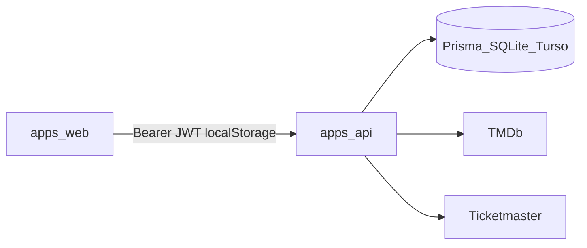

# Auditoria OWASP Top 10:2025

**Data:** 2026-08-12  
**Escopo:** `apps/api` (NestJS) + `apps/web` (Next.js) + raiz (deps / CI)  
**Referência:** [OWASP Top 10:2025](https://owasp.org/Top10/2025/)  
**Método:** revisão estática do código, `pnpm audit`, cruzamento com unit/e2e em `apps/api/test/` e `*.spec.ts`. Sem PoCs de exploit.  
**Checklist executável:** [owasp-top10-checklist.md](./owasp-top10-checklist.md) (A01–A05), [owasp-top10-checklist-a06-a10.md](./owasp-top10-checklist-a06-a10.md) (A06–A10).

Pagamento simulado e share público são decisões de produto do lab. Este relatório separa **issue real** de **risco aceito no lab**. Senha/contas seed no Lab avaliador **não** são achado (intencional para avaliação).

Correção aplicada depois da auditoria: **F-01 resolvido** (JWT/HMAC leem só `envConfig`). Os demais achados seguem abertos.

---

## Resumo executivo

Não há IDOR clássico na API: tickets, reservas e eventos mutáveis são escopados ao dono (404 se outro usuário). Roles (`CLIENT` / `ORGANIZER` / `GATE`) são enforced no servidor. Prisma não usa SQL cru. Catalogo outbound usa hosts fixos (sem SSRF). O filtro global não vaza stack ao cliente.

Gaps reais para um avaliador OWASP 2025:

| Prioridade | ID | Categoria | Título |
| --- | --- | --- | --- |
| Medio | F-03 | A07 | Access + refresh em `localStorage` |
| Medio | F-04 | A02 | API sem Helmet / headers de segurança |
| Medio | F-05 | A02 | Next sem CSP / security headers |
| Medio | F-07 | A03 / A09 | Sem CI em `.github/` |
| Medio | F-18 | A03 | `pnpm audit`: 4 high + 2 moderate (transitivos do Next) |
| Medio | F-02 | A07 | `isActive` / role não revalidados no refresh |

Nenhum achado **Critico** de broken access control na API. O pay `outcome` escolhido pelo cliente é desenho do lab (F-13), não bypass acidental.

---

## Superfície

**Auth:** Bearer access (15m) + refresh (7d, bcrypt no DB). Guards globais: JWT → Roles → Throttler. `@Public()` libera catálogo de eventos, health, login/register/refresh, share de ticket.

**Roles:** `ORGANIZER` (catálogo + CRUD de evento próprio), `CLIENT` (reserva / pay / tickets), `GATE` (validate). Sem `ADMIN`. Register força `CLIENT` em duas camadas.

**Público:** `GET /events`, `GET /events/:id` (draft só owner), seats/sectors, `GET /public/tickets/:token`, `GET /health`.

---

## Achados

Severidades: Critico / Alto / Medio / Baixo / Info.

### F-01 — JWT usa chave flat; fallbacks de `envConfig` são mortos — resolvido

- **Status:** Resolvido (2026-08-12)
- **Severidade (original):** Alto
- **OWASP:** A02 Security Misconfiguration / A04 Cryptographic Failures
- **Onde:** [`env.config.ts`](../../apps/api/src/config/env.config.ts), [`auth.module.ts`](../../apps/api/src/modules/auth/auth.module.ts), [`auth.service.ts`](../../apps/api/src/modules/auth/auth.service.ts), [`jwt-auth.guard.ts`](../../apps/api/src/common/guards/jwt-auth.guard.ts), [`jwt-refresh.guard.ts`](../../apps/api/src/modules/auth/guards/jwt-refresh.guard.ts), [`ticket-qr.service.ts`](../../apps/api/src/modules/tickets/ticket-qr.service.ts), [`app.module.ts`](../../apps/api/src/app.module.ts)

Auth, guards e HMAC leem só as chaves do `envConfig` (`jwt.accessSecret`, `jwt.refreshSecret`, `jwt.accessExpiresIn`, `jwt.refreshExpiresIn`, `ticketHmacSecret`) via `getOrThrow`. Fallbacks `change-me-*` valem só fora de produção; em `production` a factory recusa secret ausente. `validateEnv()` também roda no `ConfigModule.forRoot` (não só no `bootstrap`).

Regressão: [`env.config.spec.ts`](../../apps/api/src/config/env.config.spec.ts).

---

### F-02 — `isActive` e role só no login; refresh não reconsulta política

- **Severidade:** Medio
- **OWASP:** A07 Authentication Failures
- **Tipo:** issue real
- **Onde:** [`auth.service.ts`](../../apps/api/src/modules/auth/auth.service.ts) (`login` checa `isActive`; `refreshTokens` não), [`jwt-auth.guard.ts`](../../apps/api/src/common/guards/jwt-auth.guard.ts), [`roles.guard.ts`](../../apps/api/src/common/guards/roles.guard.ts)

Access JWT carrega `role` no claim. Guard não hidrata o user do DB. Refresh carrega o user, compara o hash, e **não** verifica `isActive`.

**Impacto:** conta desativada segue até o access expirar (~15m) e ainda **renova** o refresh (~7d). Demote de role só vale no próximo par de tokens.

**Mitigação:** checar `isActive` (e role atual) no refresh; em rotas sensíveis, hidratar do DB. Logout já zera o hash — ok para o token antigo, não para o access em curso.

---

### F-03 — Tokens em `localStorage`

- **Severidade:** Medio
- **OWASP:** A07
- **Tipo:** issue real, MVP documentado em [`prd-frontend.md`](../prd-frontend.md)
- **Onde:** [`token-storage.ts`](../../apps/web/src/features/auth/lib/token-storage.ts), [`authorized-fetch.ts`](../../apps/web/src/features/auth/lib/authorized-fetch.ts)

`ticket_access_token` e `ticket_refresh_token` no `localStorage`. Sem cookies `HttpOnly` / `Secure` / `SameSite`. CSRF de cookie não se aplica (Bearer).

**Impacto:** XSS no origin = session takeover (access + refresh). Combina com F-05 (sem CSP).

**Mitigação:** cookies httpOnly no BFF ou API; refresh só no path de auth; CSP como defesa em profundidade.

---

### F-04 — API sem Helmet / headers de segurança

- **Severidade:** Medio
- **OWASP:** A02
- **Tipo:** issue real
- **Onde:** [`main.ts`](../../apps/api/src/main.ts), [`apps/api/package.json`](../../apps/api/package.json)

Bootstrap: CORS allowlist (`FRONTEND_URL` ou `localhost:3000`) + `ValidationPipe` (whitelist + forbidNonWhitelisted). Sem Helmet. Sem Swagger (positivo). Sem `credentials` no CORS (ok com Bearer). `trust proxy` só em produção.

**Mitigação:** Helmet; HSTS em prod; nunca `FRONTEND_URL=*`.

---

### F-05 — Next sem CSP / security headers

- **Severidade:** Medio
- **OWASP:** A02
- **Tipo:** issue real
- **Onde:** [`next.config.ts`](../../apps/web/next.config.ts) — só `images.remotePatterns` (TMDb / Ticketmaster). Sem `middleware.ts`.

**Impacto:** sem CSP, XSS (se surgir) é mais explorável; combina com F-03. `` cru não passa pelo allowlist do `next/image` (ver F-10).

**Mitigação:** `headers()` com CSP, `frame-ancestors 'none'`, `nosniff`, HSTS no host.

---

### F-06 — `RoleGate` só no client

- **Severidade:** Baixo
- **OWASP:** A01 Broken Access Control
- **Tipo:** issue de UI; API continua sendo a fronteira
- **Onde:** [`role-gate.tsx`](../../apps/web/src/features/auth/components/role-gate.tsx), layouts `organizer` / `gate`

Redirect em `useEffect`. Bundles de `/organizer` e `/gate` são públicos; dados sensíveis vêm da API (403/404).

**Mitigação:** middleware/proxy checando sessão; layouts server-side.

---

### F-07 — Sem CI em `.github/`

- **Severidade:** Medio
- **OWASP:** A03 Software Supply Chain Failures / A09
- **Tipo:** processo
- **Onde:** não existe `.github/workflows`. Há `turbo.json` (`test`, `test:e2e`, `lint`) e scripts no README.

**Impacto:** regressão de IDOR / throttle / gate não é gate automático no PR. `pnpm audit` (F-18) também não roda no pipeline.

**Mitigação:** workflow: lint + unit + e2e API + `pnpm audit`.

---

### F-08 — Filtro não vaza stack; não loga HTTP 4xx

- **Severidade:** Baixo (logging) — controle positivo na resposta
- **OWASP:** A09 / A10
- **Onde:** [`all-exceptions.filter.ts`](../../apps/api/src/common/filters/all-exceptions.filter.ts)

Não-HTTP → `"Internal server error"`; stack só no `Logger.error`. HTTP → `message` do Nest + `error` + `path` + `timestamp`, **sem** stack. 401/403/429 **não** são logados.

**Mitigação:** logar 4xx de auth/throttle sem PII; manter 500 opaco.

---

### F-09 — Refresh rotaciona sem reuse detection

- **Severidade:** Baixo
- **OWASP:** A07
- **Onde:** [`auth.service.ts`](../../apps/api/src/modules/auth/auth.service.ts) (`refreshTokens` + `saveRefreshToken`)

Um hash de refresh por user. Token antigo → 401. Se o ladrão refreshar primeiro, a vítima é deslogada; a sessão do ladrão permanece (~7d). Sem família / revoke-all em reuse.

**Mitigação:** família de refresh + kill em reuse; TTL menor.

---

### F-10 — `imageUrl` do organizador sem validação de URL

- **Severidade:** Baixo
- **OWASP:** A01 (conteúdo / tracking no browser)
- **Onde:** [`create-event.dto.ts`](../../apps/api/src/modules/events/dto/create-event.dto.ts) (`@IsString()`), views com ``

Sem `dangerouslySetInnerHTML` no web. React escapa atributos (XSS clássico baixo). Host arbitrário em página pública.

**Mitigação:** `@IsUrl({ protocols: ['https'] })` + allowlist, ou só URLs do catálogo.

---

### F-11 — GATE valida qualquer `eventId`

- **Severidade:** Info
- **OWASP:** A01
- **Tipo:** lab accepted (um seed `gate@`; docs não amarram staff a evento)
- **Onde:** [`gate.controller.ts`](../../apps/api/src/modules/gate/gate.controller.ts), [`gate.service.ts`](../../apps/api/src/modules/gate/gate.service.ts)

`@Roles(GATE)` + `eventId` no body. Sem lotação gate↔evento. `WRONG_EVENT` só se o **ticket** não é daquele evento.

**Mitigação (prod):** atribuir operadores a eventos.

---

### F-12 — Share público devolve `code`; gate aceita UUID cru

- **Severidade:** Info
- **OWASP:** A06 / A01
- **Tipo:** lab accepted — [`payment-tickets.md`](../features/payment-tickets.md), [`gate.md`](../features/gate.md)
- **Onde:** [`tickets.service.ts`](../../apps/api/src/modules/tickets/tickets.service.ts) `getPublicByToken`, [`gate.service.ts`](../../apps/api/src/modules/gate/gate.service.ts) `resolveTicket`

`GET /public/tickets/:token` inclui `code` (sem `userId`/email). Gate: se `code` contém `.`, verifica HMAC (`timingSafeEqual`); senão `findUnique({ where: { code } })`. Token de share: 32 bytes (`randomBytes`), não enumerável.

**Impacto:** link `/t/:token` = credencial de entrada. É o modelo “ingresso compartilhável”. HMAC só é obrigatório se o payload tiver `.`.

**Mitigação (se endurecer):** share sem `code`; gate só HMAC.

---

### F-13 — Pay `outcome` escolhido pelo cliente

- **Severidade:** Info
- **OWASP:** A06 Insecure Design
- **Tipo:** lab accepted (PRD + README)
- **Onde:** [`pay-reservation.dto.ts`](../../apps/api/src/modules/reservations/dto/pay-reservation.dto.ts), [`reservations.service.ts`](../../apps/api/src/modules/reservations/reservations.service.ts)

`{ "outcome": "APPROVED" | "REJECTED" }`. Owner + `CLIENT` + reserva `PENDING` sem payment. Não é gateway.

**Mitigação (prod):** PSP + webhook assinado; nunca confiar em `outcome` do client.

---

### F-14 — `ALLOW_REGISTRATION` default aberto

- **Severidade:** Info
- **OWASP:** A07
- **Onde:** [`auth.service.ts`](../../apps/api/src/modules/auth/auth.service.ts) (`=== "false"`). `envConfig.allowRegistration` não é lido. Sem UI de register no MVP; API pública existe. Role no register é forçada `CLIENT` (controle positivo).

**Mitigação:** default deny em produção; ler a config aninhada.

---

### F-15 — Throttler só in-memory

- **Severidade:** Info
- **OWASP:** A02
- **Onde:** [`throttler.config.ts`](../../apps/api/src/common/throttler/throttler.config.ts) — 10/min auth, 60/min gate, 30/min catalog, 120/min default. Sem Redis. Ok no lab; frágil em multi-instância.

---

### F-16 — Política de senha só `MinLength(8)`

- **Severidade:** Baixo
- **OWASP:** A07
- **Onde:** [`register.dto.ts`](../../apps/api/src/modules/auth/dto/register.dto.ts), bcrypt cost 10. Register com email existente → 409 `"Email já está em uso"` (enumera). Login com user inexistente retorna antes do `bcrypt.compare` (timing).

**Mitigação:** política mais forte; dummy hash se user não existe; 409 genérico.

---

### F-17 — `externalPayload` no GET público de evento

- **Severidade:** Info
- **OWASP:** A01
- **Onde:** [`events.service.ts`](../../apps/api/src/modules/events/events.service.ts) `detailSelect`. JSON do catálogo (TMDb/TM), sem API keys. Draft só owner.

**Mitigação:** omitir `externalPayload` no GET público.

---

### F-18 — Dependências transitivas com advisory (`pnpm audit`)

- **Severidade:** Medio
- **OWASP:** A03
- **Tipo:** issue real (cadeia). Rodado em 2026-08-12: **6** advisories — **4 high**, **2 moderate**. Nenhum no `apps/api`. Todos via `apps/web` → `next@16.2.12` (e Tailwind PostCSS).

| Pacote | Severidade | Via | Advisory |
| --- | --- | --- | --- |
| `sharp` `<0.35.0` | high | `next>sharp` | [GHSA-f88m-g3jw-g9cj](https://github.com/advisories/GHSA-f88m-g3jw-g9cj) (libvips) |
| `postcss` | high | `next>postcss` | [GHSA-6g55-p6wh-862q](https://github.com/advisories/GHSA-6g55-p6wh-862q) (sourceMappingURL) |
| `postcss` | high | `next>postcss` | [GHSA-r28c-9q8g-f849](https://github.com/advisories/GHSA-r28c-9q8g-f849) (path traversal `.map`) |
| `nanoid` `<3.3.17` | high | `@tailwindcss/postcss>postcss>nanoid` | [GHSA-2v37-7h3g-55p8](https://github.com/advisories/GHSA-2v37-7h3g-55p8) |
| `postcss` | moderate | `next>postcss` | [GHSA-qx2v-qp2m-jg93](https://github.com/advisories/GHSA-qx2v-qp2m-jg93) (XSS stringify) |
| `postcss` | moderate | `next>postcss` | [GHSA-fxqj-rqcc-2cmp](https://github.com/advisories/GHSA-fxqj-rqcc-2cmp) (fix incompleto) |

Exploração no runtime desta app é limitada (PostCSS no build; sharp no otimizador de imagem do Next). Mesmo assim é dívida de cadeia: sem CI de audit (F-07).

**Mitigação:** bump do Next quando incluir patches; `pnpm.overrides` pontual se o framework atrasar; `pnpm audit` no CI.

Há `pnpm-lock.yaml` na raiz (bom). `postinstall: prisma generate` na API. Sem Dockerfiles reais; `.dockerignore` exclui `.env`.

---

## Riscos aceitos no lab (não são achados)

| Tema | Por quê |
| --- | --- |
| Senha e contas seed no Lab widget (`Password123!`) | Avaliação. Checklist usa essas contas. |
| Pay simulado `APPROVED`/`REJECTED` pelo cliente | PRD / README. Fora do lab seria Critico (A06/A08). |
| Share público com `code` + gate UUID | Contrato de ingresso compartilhável. |
| GATE global (qualquer evento) | Um operador seed; sem multi-tenant de portaria. |
| JWT em localStorage | Fase documentada no PRD front. |

---

## Controles que funcionam

| Controle | Onde |
| --- | --- |
| Default deny JWT + `@Public()` | `app.module.ts`, `jwt-auth.guard.ts` |
| `RolesGuard` → 403 | `roles.guard.ts` |
| Register força `CLIENT` (service + `UsersService.create` ignora role) | `auth.service.ts`, `users.service.ts` |
| Refresh hashed (bcrypt 10) + rotação | `auth.service.ts` |
| Password / refresh strip nas responses | `auth.service.ts` |
| IDOR reservas / tickets → 404 | `reservations.service.ts`, `tickets.service.ts` |
| IDOR eventos / stats / tickets do org → 404 | `events.service.ts`, `event-metrics.service.ts` |
| Draft de evento invisível a non-owner | `events.service.ts` |
| Pay só owner + `PENDING` + sem payment prévio | `reservations.service.ts` |
| HMAC QR + `timingSafeEqual` | `ticket-qr.service.ts` |
| Gate `VALID→USED` atômico (`updateMany`) | `gate.service.ts` |
| Janela de porta (`GATE_CLOSED`) | `gate.service.ts` |
| Share token 32 bytes; público sem `userId` | `ticket-qr.service.ts`, `tickets.service.ts` |
| Sem controller HTTP de users | `users.module.ts` |
| Catalogo: hosts fixos, TMDb id `^\d+$`, TM `encodeURIComponent` | `tmdb.client.ts`, `ticketmaster.client.ts` |
| Sem `$queryRaw` / `$executeRaw` | grep em `apps/api` |
| `ValidationPipe` whitelist + forbidNonWhitelisted | `main.ts` |
| CORS allowlist | `main.ts` |
| Throttle auth / gate / catalog | `throttler.config.ts` |
| Sem `dangerouslySetInnerHTML` / `eval` | grep web |
| `safeNextPath` bloqueia `//` e `://` | `safe-next-path.ts` + spec |
| 500 opaco ao cliente | `all-exceptions.filter.ts` |
| JWT/HMAC leem `envConfig` (`jwt.*` / `ticketHmacSecret`) | `auth.module.ts`, guards, `ticket-qr.service.ts` |
| Prod recusa secrets fracos/ausentes (`validateEnv` + factory) | `validate-env.ts`, `env.config.ts`, `ConfigModule` |
| Sem Swagger | `apps/api/package.json` |

---

## Mapa por categoria OWASP 2025

| # | Categoria | Neste projeto |
| --- | --- | --- |
| A01 | Broken Access Control | Ownership ok. F-06 UI, F-10 imageUrl, F-11/F-12/F-17 lab ou Info. Sem SSRF no catálogo. |
| A02 | Security Misconfiguration | F-04, F-05, F-15. F-01 resolvido. Sem Swagger. |
| A03 | Software Supply Chain Failures | F-07, F-18. Lockfile presente. |
| A04 | Cryptographic Failures | F-01 resolvido (uma fonte `envConfig`). HMAC fallback só em dev. bcrypt 10. |
| A05 | Injection | Prisma parametrizado + ValidationPipe. Sem raw SQL. |
| A06 | Insecure Design | F-12, F-13 (lab). Role no JWT. |
| A07 | Authentication Failures | F-02, F-03, F-09, F-14, F-16. Throttle auth 10/min. Open redirect mitigado. |
| A08 | Integrity Failures | Pay sem PSP (lab). QR HMAC existe; UUID cru no gate (lab). Sem uploads/webhooks. |
| A09 | Logging and Alerting | F-08, F-07. Sem alerta de brute-force além do 429. |
| A10 | Mishandling of Exceptional Conditions | 500 opaco (bom). Pay de expirada → 400 após lazy expire. Gate race → `ALREADY_USED`. HTTP 4xx não logados. |

---

## Cobertura de teste já existente

E2e em `apps/api/test/` usam services mockados (não DB real para IDOR). Ownership está nos **unit tests**.

| Arquivo | Cobre |
| --- | --- |
| `reservations.e2e-spec.ts` | 401/403 role; CLIENT cria/lista |
| `payment-tickets.e2e-spec.ts` | pay CLIENT; 403 ORGANIZER; público sem `userId` |
| `gate.e2e-spec.ts` | GATE 200; 403 CLIENT/ORGANIZER; 400 body |
| `throttler.e2e-spec.ts` | 11º login → 429; health skip |
| `events.e2e-spec.ts` | 403 CLIENT create/stats; 400 query |
| `catalog.e2e-spec.ts` | 401/403; 400 `q` vazio |
| `reservations.service.spec.ts` | getById outro user → 404 |
| `tickets.service.spec.ts` | ticket outro user → 404; público sem `userId` |
| `events.service.spec.ts` | draft escondido |
| `event-metrics.service.spec.ts` | stats 404 non-owner |
| `gate.service.spec.ts` | HMAC, UUID, tamper, VOID, WRONG_EVENT, ALREADY_USED, GATE_CLOSED, race |
| `env.config.spec.ts` | F-01: fallback JWT/HMAC em dev; throw em prod sem secret |
| `safe-next-path` spec (web) | open redirect |

Playwright (`apps/web/e2e/`) cobre fluxo feliz de checkout, não authz.

---

## Próximo passo (fora desta entrega)

Hardening sugerido, por ordem: headers/CSP (F-04/F-05) → CI + `pnpm audit` (F-07/F-18) → `isActive` no refresh (F-02) → cookies httpOnly quando sair do MVP (F-03).
